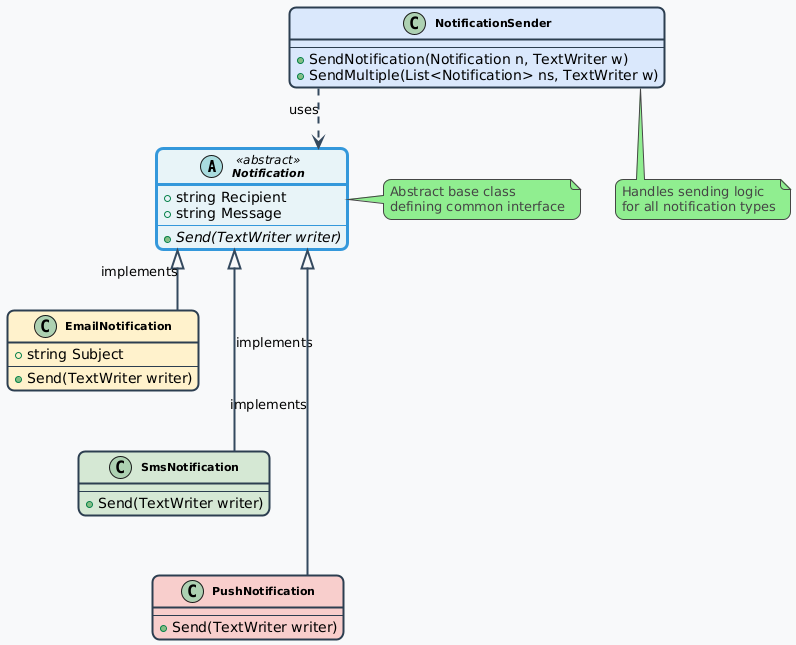

# Polymorphism: C# Notification System


This project is a C# application designed to demonstrate the principle of **polymorphism**. It implements a flexible notification system that can process and send various types of messages (Email, SMS, Push) through a common, unified interface.

The primary focus of this project is on high-quality software design, clean and maintainable code, and robust unit testing.

---

## 🎯 Core Concepts Demonstrated

* **Polymorphism:** The `NotificationSender` class works seamlessly with any object that inherits from the `Notification` base class, calling the correct `Send` method for each specific type at runtime.
* **Abstraction:** An `abstract class` (`Notification`) is used to define a common contract and share base properties (`Recipient`, `Message`) among all concrete notification types.
* **Dependency Injection:** Instead of depending on a static resource like `Console`, the system's `Send` methods accept a `TextWriter` dependency. This decouples the core logic from the output mechanism and is the key to making the system easily and reliably testable.
* **Unit Testing:** The project includes a comprehensive suite of unit tests using MSTest to verify the functionality of each component and the overall polymorphic design.

---

## 🏗️ UML Class Diagram

The following UML diagram illustrates the polymorphic design and relationships between classes:



*The diagram shows the inheritance hierarchy with the abstract `Notification` base class and its concrete implementations, along with the `NotificationSender` that uses polymorphism to work with all notification types.*

---

## 🚀 Getting Started

### Prerequisites

* .NET SDK (6.0 or newer)

### Setup

1. **Clone the repository** to your local machine:
   ```bash
   git clone https://github.com/Purusharth1/NotificationSystem.git
   ```

2. **Navigate to the solution's root directory**:
   ```bash
   cd NotificationSystem
   ```

3. **Restore dependencies and build the solution**:
   ```bash
   dotnet restore
   dotnet build
   ```

4. **(Optional) Run the demo application**:
   ```bash
   dotnet run --project NotificationSystem.Demo
   ```

---

## ✔️ Verification

The project includes specific commands to verify code quality and correctness.

### Check Coding Standards

To ensure the code adheres to the defined coding standards in `.editorconfig`, run the following command from the root directory:

```bash
dotnet format --verify-no-changes
```

### Run Unit Tests

To execute the complete suite of unit tests and verify all functionality, run:

```bash
dotnet test
```

---

## 📋 Repository Information

- **Repository URL:** [https://github.com/Purusharth1/NotificationSystem.git](https://github.com/Purusharth1/NotificationSystem.git)
- **Clone Command:** `git clone https://github.com/Purusharth1/NotificationSystem.git`
- **License:** MIT License (see LICENSE file in repository)
- **Contributing:** Pull requests and issues are welcome

---

## 💡 Design and Architecture

A key requirement of this project was a high-quality, testable design.

The decision to use an `abstract class` over an interface was made because all notification types share common data (`Recipient` and `Message`), not just a common behavior (`Send`). The abstract class allows us to define and validate these properties in one place.

The most significant design decision was refactoring the system to use **Dependency Injection for I/O**. An initial design might have used `Console.WriteLine` directly, which creates a hard dependency on a static, global resource, making unit testing difficult and unreliable. By modifying the `Send` methods to accept a `TextWriter` parameter, we inverted the dependency. The core logic no longer knows *where* it's writing to; it only knows it has a writer. This allowed the unit tests to provide a `StringWriter` to capture the output for verification, making the tests simple, fast, and 100% reliable.